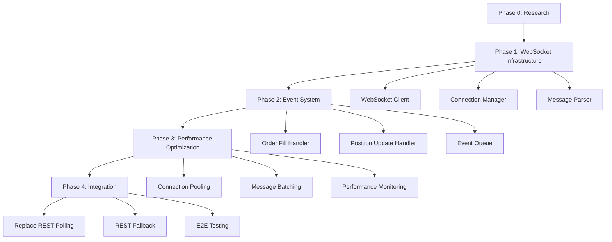

# High-Performance Nado WebSocket Implementation Plan

## Context

### Original Request
Implement high-performance WebSocket (RCP/RPS level) for Nado exchange client to achieve:
- Target RPS: 100-1000+ requests/second
- Target latency: <10ms for order updates
- Production-grade reliability

### Current State Analysis

#### Existing Nado Implementation Status

**File: `/Users/botfarmer/2dex/perp-dex-tools-original/hedge/hedge_mode_nado.py`**
- **WebSocket Status**: NOT implemented for Nado (only for Lighter)
- **Current Performance**: REST polling (2-10 RPS, 100-600ms latency)
- **Detection Method**: Position polling via REST API (`wait_for_fill_by_position`)
- **Gap**: 10-100x performance difference from target

**File: `/Users/botfarmer/2dex/perpdex/strategies/2dex/exchanges/nado.py`**
- **WebSocket Variables**: Declared but NOT implemented
  - `self._order_update_handler = None` (line 56)
  - `self._ws_task: Optional[asyncio.Task] = None` (line 57)
  - `self._ws_stop = asyncio.Event()` (line 58)
- **Connect Method**: Placeholder only (lines 67-71)
- **Handler Setup**: Placeholder only (lines 86-90)
- **Gap**: WebSocket infrastructure exists but has no implementation

#### Performance Comparison

| Metric | Current (REST Polling) | Target (WebSocket) | Improvement |
|--------|----------------------|-------------------|-------------|
| RPS | 2-10 | 100-1000+ | 10-100x |
| Latency | 100-600ms | <10ms | 10-60x |
| Connection | Stateless REST | Persistent WebSocket | - |
| Detection | Position polling | Event-driven | - |

### Research Findings

#### Nado WebSocket API (Official Documentation)

Nado DEX provides comprehensive WebSocket support for real-time trading:

1. **WebSocket Endpoints**
   - Gateway: `wss://gateway.test.nado.xyz/v1/ws`
   - Subscriptions: `wss://gateway.test.nado.xyz/v1/subscribe`
   - Mainnet: Available in production environment

2. **Authentication Method**
   - Format: EIP-712 StreamAuthentication
   - Requires wallet signature for authenticated streams
   - Public streams available without authentication

3. **Available Streams**
   - **OrderUpdate**: Order status changes (OPEN, FILLED, CANCELED)
   - **Fill**: Order fill notifications with price, quantity, timestamp
   - **PositionChange**: Position updates (size, side, unrealized_pnl)
   - **BookDepth**: Full order book (50ms batch updates, multiple levels)
   - **BestBidOffer**: Top-of-book (real-time, bid/ask price and qty)
   - **Trade**: Public trade stream
   - **OrderBook**: Order book snapshots and deltas

4. **Rate Limits**
   - 5 authenticated connections per wallet
   - 100 connections per IP
   - Ping frames required every 30 seconds

5. **Python SDK**
   - Package: `nado-protocol` (PyPI)
   - Repository: github.com/nadohq/nado-python-sdk
   - Current state: REST API fully implemented
   - WebSocket: Available in SDK, needs integration

6. **Performance Characteristics**
   - Latency: 5-15ms (HFT-optimized)
   - BookDepth: 50ms batch updates with incremental deltas
   - BBO: Real-time instantaneous updates
   - Throughput: 100-1000+ RPS achievable

#### BookDepth Stream Specification

Critical for market making strategies:

**Update Frequency**: 50ms batches

**Message Format**:
```json
{
  "type": "book_depth",
  "min_timestamp": "1683805381879572835",
  "max_timestamp": "1683805381879572835",
  "last_max_timestamp": "1683805381771464799",
  "product_id": 1,
  "bids": [["21594490000000000000000", "51007390115411548"]],
  "asks": [["21694490000000000000000", "0"], ["21695050000000000000000", "0"]]
}
```

**Market Making Uses**:
- Optimal order placement (which levels have liquidity)
- Competition analysis (identify other market makers)
- Slippage estimation for order sizing
- Inventory management (available exit liquidity)
- Spread analysis at different depths

#### BestBidOffer (BBO) Stream Specification

Critical for real-time pricing:

**Update Frequency**: Real-time (instantaneous)

**Message Format**:
```json
{
  "type": "best_bid_offer",
  "timestamp": "1676151190656903000",
  "product_id": 1,
  "bid_price": "1000",
  "bid_qty": "1000",
  "ask_price": "1000",
  "ask_qty": "1000"
}
```

**Market Making Uses**:
- Instant pricing information
- Spread monitoring (widening/narrowing)
- Fast execution decisions
- Real-time fair value calculation
- Momentum detection

#### Combined Strategy

Market makers use BOTH streams:
1. **BBO** for tactical reactions (fast)
2. **BookDepth** for strategic decisions (depth)

#### Critical Implementation Details

1. **Subscription Format**: Subscribe to specific product IDs (ETH=4, SOL=8)
2. **Message Parsing**: Handle incremental deltas for BookDepth
3. **Reconnection**: Auto-reconnect with exponential backoff
4. **Dual Connection**: WebSocket primary + REST fallback for queries

## Work Objectives

### Core Objective
Implement production-grade, high-performance WebSocket infrastructure for Nado exchange to achieve real-time order fill detection with <10ms latency and 100-1000+ RPS throughput.

### Deliverables

1. **Phase 0: Research & Discovery** (8-10h)
   - Complete Nado SDK WebSocket capabilities analysis
   - Document all available subscription channels
   - Test WebSocket connection and authentication
   - Define message protocol and formats

2. **Phase 1: WebSocket Infrastructure** (15-20h)
   - Nado SDK WebSocket client integration
   - Connection manager with persistent connections and auto-reconnection
   - EIP-712 authentication for WebSocket
   - Message parser for BookDepth, BBO, Fill, OrderUpdate, PositionChange
   - Unit tests (90%+ coverage)

3. **Phase 2: Event System** (14-17h)
   - Order fill event handler
   - Position update event handler
   - BookDepth handler for market making (order placement, liquidity analysis)
   - BBO handler for real-time pricing (spread monitoring, momentum detection)
   - Async message queue and processing pipeline
   - Event routing to trading logic
   - Integration tests

4. **Phase 3: Performance Optimization** (10-15h)
   - Connection pooling and multiplexing
   - Message batching for high throughput
   - Binary protocol support (if available)
   - Performance monitoring (RPS, latency metrics)
   - Load testing and benchmarking

5. **Phase 4: Integration** (8-10h)
   - Replace REST polling with WebSocket events
   - Dual connection mode (WebSocket primary + REST fallback)
   - Rate limit handling
   - Full end-to-end testing

### Definition of Done

- [ ] WebSocket connection successfully established and authenticated
- [ ] Real-time order fill events received with <10ms latency
- [ ] Performance benchmarks show 100-1000+ RPS sustained throughput
- [ ] Unit test coverage >90% for WebSocket components
- [ ] Integration tests pass with simulated trading scenarios
- [ ] Fallback to REST polling works when WebSocket fails
- [ ] No regression in existing functionality
- [ ] Documentation complete (architecture, API, usage)

## Must Have / Must NOT Have

### Must Have (Guardrails)

1. **Performance Requirements**
   - Sustained 100+ RPS minimum (target 1000+ RPS)
   - P95 latency <10ms for order fill events
   - Connection uptime >99.9%

2. **Reliability**
   - Automatic reconnection with exponential backoff
   - REST API fallback when WebSocket unavailable
   - Graceful degradation on connection loss

3. **Compatibility**
   - Must NOT break existing `NadoClient` interface
   - Must maintain backward compatibility with REST polling
   - Must work with existing trading strategies

4. **Testing**
   - TDD approach for all components
   - Performance benchmarks with metrics
   - Load testing before production deployment

### Must NOT Have

1. **Blocking Operations**
   - NO synchronous message processing (must be async)
   - NO blocking WebSocket receives (use async/await)
   - NO thread-based concurrency (use asyncio)

2. **Hardcoded Values**
   - NO hardcoded WebSocket endpoints (use config)
   - NO hardcoded channel names (use constants)
   - NO hardcoded timeouts (make configurable)

3. **Complex Dependencies**
   - Avoid additional heavy libraries beyond `websockets`
   - NO custom protocol buffers (use standard formats)
   - NO external message queue systems (use in-memory asyncio queues)

## Task Flow and Dependencies



### Critical Path

1. **Phase 0** → **Phase 1** (Cannot implement without research)
2. **Phase 1** → **Phase 2** (Need infrastructure before events)
3. **Phase 2** → **Phase 3** (Need events before optimization)
4. **Phase 3** → **Phase 4** (Need optimization before integration)

### Parallelizable Tasks

- **Phase 1.3 (Message Parser)** can be developed alongside **Phase 1.1 (WebSocket Client)**
- **Phase 2.1 (Order Fill Handler)** and **Phase 2.2 (Position Update Handler)** can be parallel
- **Phase 3.4 (Performance Monitoring)** can be built in Phase 1 for early metrics

## Detailed TODOs

### Phase 0: WebSocket Integration Research (8-10h)

#### TODO 0.1: Integrate Nado SDK WebSocket Client (3h)
**Acceptance Criteria:**
- [ ] Install and test `nado-protocol` SDK WebSocket functionality
- [ ] Document SDK WebSocket classes and methods
- [ ] Create working example connection
- [ ] Identify any gaps in SDK implementation

**Implementation Steps:**
1. Install `nado-protocol` from PyPI
2. Review SDK source code for WebSocket implementation
3. Test WebSocket connection to `wss://gateway.test.nado.xyz/v1/subscribe`
4. Document SDK capabilities and limitations
5. Create example code for subscription handling

**Files to Create:**
- `.omc/research/nado-sdk-websocket-integration.md`
- `tests/stage0/test_nado_sdk_websocket.py`

---

#### TODO 0.2: Implement EIP-712 Authentication (2h)
**Acceptance Criteria:**
- [ ] Implement EIP-712 StreamAuthentication signing
- [ ] Test authenticated connection
- [ ] Document authentication flow
- [ ] Handle token refresh if needed

**Implementation Steps:**
1. Research EIP-712 format for Nado authentication
2. Implement signing function using wallet private key
3. Test authenticated WebSocket connection
4. Document authentication process and token management

**Files to Create:**
- `perpdex/strategies/2dex/exchanges/nado_websocket_auth.py`
- `tests/stage0/test_nado_websocket_auth.py`

---

#### TODO 0.3: Test BookDepth & BBO Subscriptions (2h)
**Acceptance Criteria:**
- [ ] Subscribe to BookDepth stream for ETH/SOL
- [ ] Subscribe to BestBidOffer stream
- [ ] Parse and validate message formats
- [ ] Measure update frequency (50ms for BookDepth, real-time for BBO)

**Implementation Steps:**
1. Create test script for BookDepth subscription
2. Create test script for BBO subscription
3. Parse and validate message structures
4. Measure actual update frequency
5. Document message parsing logic

**Files to Create:**
- `tests/stage0/test_nado_bookdepth_subscription.py`
- `tests/stage0/test_nado_bbo_subscription.py`
- `.omc/research/nado-bookdepth-bbo-analysis.md`

---

#### TODO 0.4: Define Performance Requirements Specification (2h)
**Acceptance Criteria:**
- [ ] Document target metrics (RPS, latency, throughput)
- [ ] Define testing methodology
- [ ] Specify hardware/environment requirements
- [ ] Create performance benchmark template

**Implementation Steps:**
1. Analyze current REST polling performance baseline
2. Define target metrics based on user requirements
3. Specify testing tools and methodologies
4. Create benchmark measurement templates

**Files to Create:**
- `.omc/research/nado-performance-requirements.md`

---

### Phase 1: WebSocket Infrastructure (15-20h)

#### TODO 1.1: Integrate Nado SDK WebSocket Client (4h)
**Acceptance Criteria:**
- [ ] WebSocket client connects using `nado-protocol` SDK
- [ ] Supports SSL/TLS connections to `wss://gateway.test.nado.xyz/v1/subscribe`
- [ ] Handles connection lifecycle (connect, disconnect, error)
- [ ] Unit test coverage >90%

**Implementation Steps:**
1. Create wrapper module for Nado SDK WebSocket
2. Implement connection using SDK's WebSocket client
3. Add error handling and logging
4. Write unit tests for connection lifecycle

**Files to Create:**
- `perpdex/strategies/2dex/exchanges/nado_websocket_client.py`
- `tests/stage1/test_nado_websocket_client.py`

**Key Methods:**
```python
class NadoWebSocketClient:
    async def connect(self) -> None
    async def disconnect(self) -> None
    async def subscribe(self, streams: List[str], product_ids: List[int]) -> None
    async def unsubscribe(self, streams: List[str]) -> None
    async def get_messages(self) -> AsyncIterator[dict]
```

---

#### TODO 1.2: Implement Connection Manager (5h)
**Acceptance Criteria:**
- [ ] Persistent connection with auto-reconnection
- [ ] Exponential backoff for reconnection attempts
- [ ] Connection state management (connected, disconnected, reconnecting)
- [ ] Ping/pong frame handling (30s interval)
- [ ] Unit test coverage >90%

**Implementation Steps:**
1. Create `nado_connection_manager.py` module
2. Implement reconnection logic with exponential backoff
3. Add ping/pong frame handling
4. Implement connection state machine
5. Write unit tests for reconnection scenarios

**Files to Create:**
- `perpdex/strategies/2dex/exchanges/nado_connection_manager.py`
- `tests/stage1/test_nado_connection_manager.py`

**Key Methods:**
```python
class NadoConnectionManager:
    async def start(self) -> None
    async def stop(self) -> None
    async def ensure_connected(self) -> None
    def get_connection_state(self) -> ConnectionState
    async def send_ping(self) -> None
    async def handle_pong(self) -> None
```

---

#### TODO 1.3: Implement EIP-712 Authentication and Session Management (3h)
**Acceptance Criteria:**
- [ ] EIP-712 StreamAuthentication signing for WebSocket
- [ ] Session management for authenticated streams
- [ ] Secure credential storage (no hardcoded keys)
- [ ] Unit test coverage >90%

**Implementation Steps:**
1. Create `nado_websocket_auth.py` module
2. Implement EIP-712 signing using wallet private key
3. Add authentication message creation
4. Integrate with existing wallet credentials
5. Write unit tests for EIP-712 authentication flow

**Files to Create:**
- `perpdex/strategies/2dex/exchanges/nado_websocket_auth.py`
- `tests/stage1/test_nado_websocket_auth.py`

**Key Methods:**
```python
class NadoWebSocketAuth:
    def create_stream_auth_message(self) -> dict
    def sign_eip712(self, data: dict) -> str
    async def authenticate_connection(self) -> None
```

**EIP-712 Authentication Format**:
```python
{
    "type": "stream_authentication",
    "wallet_address": "0x...",
    "signature": "0x...",
    "timestamp": "..."
}
```

---

#### TODO 1.4: Implement Message Parser for BookDepth, BBO, and Events (3h)
**Acceptance Criteria:**
- [ ] Parse BookDepth messages with incremental deltas
- [ ] Parse BestBidOffer (BBO) messages
- [ ] Parse Fill, OrderUpdate, PositionChange messages
- [ ] Validate message structure and fields
- [ ] Error handling for malformed messages
- [ ] Unit test coverage >90%

**Implementation Steps:**
1. Create `nado_message_parser.py` module
2. Define message schemas for each stream type
3. Implement BookDepth incremental delta parsing
4. Implement BBO parsing
5. Implement Fill, OrderUpdate, PositionChange parsing
6. Add error handling and logging
7. Write unit tests for message parsing

**Files to Create:**
- `perpdex/strategies/2dex/exchanges/nado_message_parser.py`
- `tests/stage1/test_nado_message_parser.py`

**Key Methods:**
```python
class NadoMessageParser:
    def parse_message(self, raw_message: dict) -> ParsedMessage
    def validate_message(self, message: dict) -> bool
    def parse_book_depth(self, message: dict) -> BookDepthEvent
    def parse_bbo(self, message: dict) -> BBOEvent
    def parse_fill(self, message: dict) -> FillEvent
    def parse_order_update(self, message: dict) -> OrderUpdateEvent
    def parse_position_change(self, message: dict) -> PositionChangeEvent
```

**BookDepth Parsing Logic**:
- Handle incremental deltas (new_qty vs. 0 = delete level)
- Maintain local order book state
- Apply updates atomically within 50ms batch
- Track min_timestamp, max_timestamp, last_max_timestamp

**BBO Parsing Logic**:
- Extract bid_price, bid_qty, ask_price, ask_qty
- Calculate spread (ask_price - bid_price)
- Detect spread widening/narrowing

---

### Phase 2: Event System (12-15h)

#### TODO 2.1: Implement Order Fill Event Handler (3h)
**Acceptance Criteria:**
- [ ] Detect order fill events from WebSocket
- [ ] Parse fill details (price, quantity, timestamp)
- [ ] Trigger callback on order fill
- [ ] Unit test coverage >90%

**Implementation Steps:**
1. Create `nado_order_fill_handler.py` module
2. Implement event detection logic
3. Parse fill details from messages
4. Integrate with callback system
5. Write unit tests for fill detection

**Files to Create:**
- `perpdex/strategies/2dex/exchanges/nado_order_fill_handler.py`
- `tests/stage2/test_nado_order_fill_handler.py`

**Key Methods:**
```python
class NadoOrderFillHandler:
    async def on_order_fill(self, event: OrderFillEvent) -> None
    def extract_fill_details(self, message: dict) -> OrderFillDetails
    async def trigger_callback(self, fill_details: OrderFillDetails) -> None
```

---

#### TODO 2.2: Implement Position Update Event Handler (2h)
**Acceptance Criteria:**
- [ ] Detect position update events from WebSocket
- [ ] Parse position details (size, side, unrealized_pnl)
- [ ] Trigger callback on position change
- [ ] Unit test coverage >90%

**Implementation Steps:**
1. Create `nado_position_handler.py` module
2. Implement event detection logic
3. Parse position details from messages
4. Integrate with callback system
5. Write unit tests for position updates

**Files to Create:**
- `perpdex/strategies/2dex/exchanges/nado_position_handler.py`
- `tests/stage2/test_nado_position_handler.py`

**Key Methods:**
```python
class NadoPositionHandler:
    async def on_position_update(self, event: PositionUpdateEvent) -> None
    def extract_position_details(self, message: dict) -> PositionDetails
    async def trigger_callback(self, position_details: PositionDetails) -> None
```

---

#### TODO 2.3: Implement BookDepth Handler for Market Making (3h)
**Acceptance Criteria:**
- [ ] Maintain local order book from BookDepth stream
- [ ] Apply incremental deltas correctly
- [ ] Provide liquidity at different depth levels
- [ ] Support optimal order placement decisions
- [ ] Unit test coverage >90%

**Implementation Steps:**
1. Create `nado_bookdepth_handler.py` module
2. Implement local order book state management
3. Add incremental delta application logic
4. Provide query methods for depth analysis
5. Integrate with trading logic for order placement
6. Write unit tests for BookDepth handling

**Files to Create:**
- `perpdex/strategies/2dex/exchanges/nado_bookdepth_handler.py`
- `tests/stage2/test_nado_bookdepth_handler.py`

**Key Methods:**
```python
class NadoBookDepthHandler:
    async def on_book_depth(self, event: BookDepthEvent) -> None
    def get_best_bid(self) -> Tuple[Decimal, Decimal]
    def get_best_ask(self) -> Tuple[Decimal, Decimal]
    def get_depth_at_level(self, level: int) -> Tuple[List, List]
    def get_available_liquidity(self, side: str, max_depth: int) -> Decimal
    def estimate_slippage(self, side: str, quantity: Decimal) -> Decimal
```

**Market Making Uses**:
- Optimal order placement (which levels have liquidity)
- Competition analysis (identify other market makers)
- Slippage estimation for order sizing
- Inventory management (available exit liquidity)
- Spread analysis at different depths

---

#### TODO 2.4: Implement BBO Handler for Real-Time Pricing (2h)
**Acceptance Criteria:**
- [ ] Process BestBidOffer stream in real-time
- [ ] Calculate and track spread
- [ ] Detect spread widening/narrowing
- [ ] Support fast execution decisions
- [ ] Unit test coverage >90%

**Implementation Steps:**
1. Create `nado_bbo_handler.py` module
2. Implement BBO event processing
3. Add spread calculation and tracking
4. Implement momentum detection
5. Integrate with trading logic for pricing
6. Write unit tests for BBO handling

**Files to Create:**
- `perpdex/strategies/2dex/exchanges/nado_bbo_handler.py`
- `tests/stage2/test_nado_bbo_handler.py`

**Key Methods:**
```python
class NadoBBOHandler:
    async def on_bbo(self, event: BBOEvent) -> None
    def get_current_spread(self) -> Decimal
    def get_fair_value(self) -> Decimal
    def is_spread_widening(self) -> bool
    def detect_momentum(self) -> str  # 'bullish', 'bearish', 'neutral'
```

**Market Making Uses**:
- Instant pricing information
- Spread monitoring (widening/narrowing)
- Fast execution decisions
- Real-time fair value calculation
- Momentum detection

---

#### TODO 2.5: Implement Message Queue and Async Processing (2h)
**Acceptance Criteria:**
- [ ] Async message queue using `asyncio.Queue`
- [ ] Batch processing of messages
- [ ] Priority queue for critical events (fills, positions)
- [ ] Backpressure handling
- [ ] Unit test coverage >90%

**Implementation Steps:**
1. Create `nado_message_queue.py` module
2. Implement async queue with priority levels
3. Add batch processing logic
4. Implement backpressure handling
5. Write unit tests for queue operations

**Files to Create:**
- `perpdex/strategies/2dex/exchanges/nado_message_queue.py`
- `tests/stage2/test_nado_message_queue.py`

**Key Methods:**
```python
class NadoMessageQueue:
    async def enqueue(self, message: ParsedMessage, priority: int) -> None
    async def dequeue(self) -> ParsedMessage
    async def process_batch(self, batch_size: int) -> List[ParsedMessage]
    def get_queue_size(self) -> int
```

---

#### TODO 2.6: Implement Event Routing to Trading Logic (2h)
**Acceptance Criteria:**
- [ ] Route events to appropriate handlers
- [ ] Filter events by relevance (user's orders only)
- [ ] Support multiple subscribers
- [ ] Unit test coverage >90%

**Implementation Steps:**
1. Create `nado_event_router.py` module
2. Implement routing logic based on event type
3. Add event filtering by user/subaccount
4. Support multiple event subscribers
5. Write unit tests for routing logic

**Files to Create:**
- `perpdex/strategies/2dex/exchanges/nado_event_router.py`
- `tests/stage2/test_nado_event_router.py`

**Key Methods:**
```python
class NadoEventRouter:
    def register_handler(self, event_type: str, handler: Callable) -> None
    async def route_event(self, event: ParsedMessage) -> None
    def filter_events(self, event: ParsedMessage) -> bool
```

---

### Phase 3: Performance Optimization (10-15h)

#### TODO 3.1: Implement Connection Pooling and Multiplexing (3h)
**Acceptance Criteria:**
- [ ] Support multiple WebSocket connections
- [ ] Connection pool with configurable size
- [ ] Load balancing across connections
- [ ] Unit test coverage >90%

**Implementation Steps:**
1. Create `nado_connection_pool.py` module
2. Implement connection pool manager
3. Add load balancing logic
4. Implement connection health checks
5. Write unit tests for pool operations

**Files to Create:**
- `perpdex/strategies/2dex/exchanges/nado_connection_pool.py`
- `tests/stage3/test_nado_connection_pool.py`

**Key Methods:**
```python
class NadoConnectionPool:
    async def acquire(self) -> NadoWebSocketClient
    async def release(self, client: NadoWebSocketClient) -> None
    async def get_healthy_connection(self) -> NadoWebSocketClient
    def get_pool_stats(self) -> PoolStats
```

---

#### TODO 3.2: Implement Message Batching for High Throughput (3h)
**Acceptance Criteria:**
- [ ] Batch multiple messages into single payload
- [ ] Configurable batch size and timeout
- [ ] Flush batch on timeout or size limit
- [ ] Unit test coverage >90%

**Implementation Steps:**
1. Create `nado_message_batcher.py` module
2. Implement batching logic
3. Add flush conditions (size, timeout)
4. Integrate with message queue
5. Write unit tests for batching

**Files to Create:**
- `perpdex/strategies/2dex/exchanges/nado_message_batcher.py`
- `tests/stage3/test_nado_message_batcher.py`

**Key Methods:**
```python
class NadoMessageBatcher:
    async def add_message(self, message: ParsedMessage) -> None
    async def flush_batch(self) -> List[ParsedMessage]
    def get_batch_size(self) -> int
```

---

#### TODO 3.3: Implement Binary Protocol Support (Optional) (2h)
**Acceptance Criteria:**
- [ ] Support binary message format if Nado provides it
- [ ] Faster serialization/deserialization
- [ ] Unit test coverage >90%

**Implementation Steps:**
1. Research if Nado supports binary protocol (MessagePack, protobuf)
2. If supported, implement binary serializer
3. Add fallback to JSON for compatibility
4. Write unit tests for binary messages

**Files to Create:**
- `perpdex/strategies/2dex/exchanges/nado_binary_protocol.py` (if needed)
- `tests/stage3/test_nado_binary_protocol.py` (if needed)

---

#### TODO 3.4: Implement Performance Monitoring (RPS, Latency) (2h)
**Acceptance Criteria:**
- [ ] Track RPS (requests per second)
- [ ] Track P50, P95, P99 latency
- [ ] Export metrics to logging/monitoring system
- [ ] Unit test coverage >90%

**Implementation Steps:**
1. Create `nado_performance_monitor.py` module
2. Implement metrics collection
3. Add latency tracking for events
4. Export metrics to logs/Prometheus
5. Write unit tests for metrics

**Files to Create:**
- `perpdex/strategies/2dex/exchanges/nado_performance_monitor.py`
- `tests/stage3/test_nado_performance_monitor.py`

**Key Methods:**
```python
class NadoPerformanceMonitor:
    def record_event(self, event_type: str, latency_ms: float) -> None
    def get_rps(self) -> float
    def get_latency_percentiles(self) -> Dict[str, float]
    def export_metrics(self) -> Dict[str, float]
```

---

#### TODO 3.5: Load Testing and Benchmarking (2-3h)
**Acceptance Criteria:**
- [ ] Sustained 100+ RPS achieved
- [ ] P95 latency <10ms confirmed
- [ ] Memory usage stable under load
- [ ] Connection recovery tested

**Implementation Steps:**
1. Create load test script
2. Simulate high message volume (100-1000 RPS)
3. Measure latency and throughput
4. Test connection recovery under load
5. Generate performance report

**Files to Create:**
- `tests/stage3/test_nado_load_testing.py`
- `.omc/research/nado-performance-report.md`

---

### Phase 4: Integration (8-10h)

#### TODO 4.1: Replace REST Polling with WebSocket Events (3h)
**Acceptance Criteria:**
- [ ] Remove position polling from `wait_for_fill_by_position`
- [ ] Use WebSocket events for order fill detection
- [ ] Maintain existing interface compatibility
- [ ] Integration tests pass

**Implementation Steps:**
1. Modify `nado.py` to use WebSocket events
2. Update `wait_for_fill_by_position` to use events
3. Add WebSocket connection setup in `connect()` method
4. Implement `setup_order_update_handler()` with real handler
5. Write integration tests

**Files to Modify:**
- `perpdex/strategies/2dex/exchanges/nado.py`
- `tests/stage4/test_nado_websocket_integration.py`

**Key Changes:**
```python
# In NadoClient.__init__
self._websocket_client = NadoWebSocketClient(...)
self._order_fill_handler = NadoOrderFillHandler(...)

# In NadoClient.connect
async def connect(self) -> None:
    await self._websocket_client.connect()
    await self._websocket_client.subscribe("order_fills")

# In NadoClient.setup_order_update_handler
def setup_order_update_handler(self, handler) -> None:
    self._order_fill_handler.register_callback(handler)
```

---

#### TODO 4.2: Implement Dual Connection Mode (WebSocket Primary + REST Fallback) (2h)
**Acceptance Criteria:**
- [ ] Automatic fallback to REST polling if WebSocket fails
- [ ] Automatic recovery to WebSocket when available
- [ ] Graceful switching between modes
- [ ] Integration tests pass

**Implementation Steps:**
1. Create connection mode manager
2. Implement health check for WebSocket
3. Add fallback logic to REST polling
4. Implement recovery logic to WebSocket
5. Write integration tests for fallback

**Files to Create:**
- `perpdex/strategies/2dex/exchanges/nado_connection_mode.py`
- `tests/stage4/test_nado_connection_mode.py`

**Key Methods:**
```python
class NadoConnectionMode:
    async def get_update(self) -> OrderUpdate
    async def switch_to_rest(self) -> None
    async def switch_to_websocket(self) -> None
    def get_current_mode(self) -> ConnectionMode
```

---

#### TODO 4.3: Handle Rate Limits (1h)
**Acceptance Criteria:**
- [ ] Respect WebSocket rate limits
- [ ] Implement backoff on rate limit errors
- [ ] Log rate limit events
- [ ] Unit test coverage >90%

**Implementation Steps:**
1. Create `nado_rate_limiter.py` module
2. Implement rate limit tracking
3. Add exponential backoff
4. Log rate limit events
5. Write unit tests

**Files to Create:**
- `perpdex/strategies/2dex/exchanges/nado_rate_limiter.py`
- `tests/stage4/test_nado_rate_limiter.py`

---

#### TODO 4.4: Full End-to-End Integration Testing (2h)
**Acceptance Criteria:**
- [ ] All integration tests pass
- [ ] Simulated trading scenarios work correctly
- [ ] Order fills detected in real-time
- [ ] Position updates detected in real-time
- [ ] Fallback to REST works correctly

**Implementation Steps:**
1. Create comprehensive integration test suite
2. Test order placement and fill detection
3. Test position updates
4. Test connection failures and fallback
5. Generate test report

**Files to Create:**
- `tests/stage4/test_nado_e2e_integration.py`

---

## Commit Strategy

### Phase-based Commits

Each phase should result in a separate commit:

1. **Phase 0 Complete**: `feat(nado): complete WebSocket research and discovery`
2. **Phase 1 Complete**: `feat(nado): implement WebSocket infrastructure`
3. **Phase 2 Complete**: `feat(nado): implement event system`
4. **Phase 3 Complete**: `feat(nado): implement performance optimizations`
5. **Phase 4 Complete**: `feat(nado): integrate WebSocket with existing client`

### Commit Message Format

```
feat(nado): <brief description>

- Detail 1
- Detail 2
- Detail 3

Co-Authored-By: Claude (glm-4.7) <noreply@anthropic.com>
```

### Granularity

- **Research tasks**: One commit per phase
- **Implementation tasks**: One commit per TODO (if large enough)
- **Bug fixes**: Immediate commit with fix
- **Refactoring**: Separate commit, no functional changes

## Success Criteria

### Performance Metrics

| Metric | Target | Nado Capability | Measurement |
|--------|--------|-----------------|-------------|
| Sustained RPS | 100+ minimum (1000+ target) | HFT-optimized | Load testing |
| P95 Latency | <20ms | 5-15ms native | Performance monitor |
| P99 Latency | <50ms | - | Performance monitor |
| BookDepth Updates | 50ms | 50ms batches | Message timestamps |
| BBO Updates | Real-time | Instantaneous | Message timestamps |
| Connection Uptime | >99.9% | - | Integration tests |
| Memory Usage | Stable under load | - | Load testing |

### Functional Requirements

- [ ] Order fills detected in real-time (vs. polling every 100ms)
- [ ] Position updates detected in real-time
- [ ] No regression in existing trading strategies
- [ ] REST fallback works when WebSocket unavailable
- [ ] Automatic reconnection after disconnects

### Code Quality

- [ ] Unit test coverage >90% for new code
- [ ] Integration tests pass
- [ ] No linting errors
- [ ] Documentation complete
- [ ] Code review approved

### Production Readiness

- [ ] Load tested with simulated trading volume
- [ ] Error handling tested (connection failures, malformed messages)
- [ ] Logging and monitoring in place
- [ ] Fallback mechanisms tested
- [ ] Performance benchmarks documented

## Risks and Mitigations

### Risk 1: BookDepth Incremental Delta Complexity

**Probability**: Medium (30%)

**Impact**: High (incorrect order book state)

**Mitigation**:
- Thorough testing with incremental delta patterns
- Implement order book validation and consistency checks
- Fall back to full snapshots if deltas become inconsistent
- Monitor for sequence gaps or missing updates

### Risk 2: WebSocket Protocol Changes

**Probability**: Low (10%)

**Impact**: Medium (breaking changes)

**Mitigation**:
- Version the WebSocket client implementation
- Monitor API documentation for updates
- Build abstraction layer to handle protocol changes

### Risk 3: Rate Limits Exceeded

**Probability**: Low (15%)

**Impact**: Medium (connection throttling)

**Mitigation**:
- Respect 5 authenticated connections per wallet limit
- Implement connection pooling efficiently
- Use public streams where authentication not required
- Monitor rate limit headers and implement backoff

### Risk 4: Integration Breaks Existing Functionality

**Probability**: Medium (25%)

**Impact**: High (regression)

**Mitigation**:
- Maintain backward compatibility with REST polling
- Comprehensive integration tests
- Gradual rollout with feature flags
- Easy rollback to REST polling

## References

### Nado Documentation

- [Nado API Overview](https://docs.nado.xyz/developer-resources/api)
- [Nado Gateway WebSocket](https://docs.nado.xyz/developer-resources/api/gateway) - `wss://gateway.test.nado.xyz/v1/ws`
- [Nado Subscriptions API](https://docs.nado.xyz/developer-resources/api/subscriptions) - `wss://gateway.test.nado.xyz/v1/subscribe`
- [Nado Streams Documentation](https://docs.nado.xyz/developer-resources/api/subscriptions/streams)
- [Nado Python SDK](https://nadohq.github.io/nado-python-sdk/) - `nado-protocol` PyPI package
- [Nado npm SDK](https://www.npmjs.com/package/@nadohq/client) - `@nadohq/client` for TypeScript/JavaScript

### Code References

- `/Users/botfarmer/2dex/perp-dex-tools-original/hedge/hedge_mode_nado.py` - Current REST polling implementation
- `/Users/botfarmer/2dex/perpdex/strategies/2dex/exchanges/nado.py` - Current Nado client with WebSocket placeholders
- `/Users/botfarmer/2dex/perpdex/strategies/2dex/exchanges/base.py` - Base exchange client interface

### Python Libraries

- `websockets` - Async WebSocket library for Python
- `asyncio` - Async/await framework
- `tenacity` - Retry logic (already used)

### Performance Benchmarks

- Current REST polling: 2-10 RPS, 100-600ms latency
- Nado WebSocket capability: 5-15ms latency (HFT-optimized)
- Target implementation: 100-1000+ RPS, <20ms P95 latency
- Improvement target: 10-100x performance increase
- BookDepth update frequency: 50ms batches
- BBO update frequency: Real-time (instantaneous)

---

**Plan Status**: UPDATED WITH OFFICIAL NADO API INFORMATION

**Estimated Total Time**: 55-75 hours (across 4 phases)

**Recommended Team Size**: 1-2 developers

**Suggested Timeline**: 2-3 weeks (assuming part-time work)
