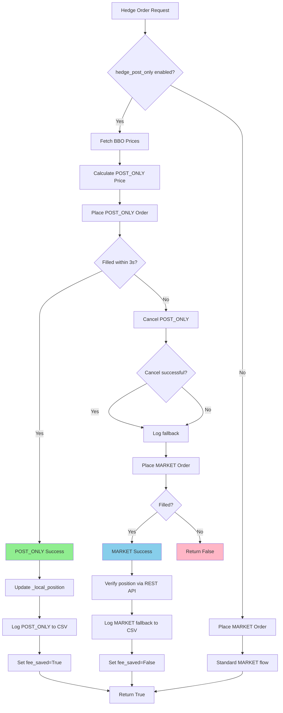
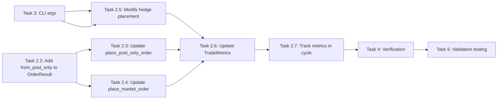

# POST_ONLY and Timeout Optimization Plan

**Plan ID:** POST_ONLY_TIMEOUT_OPT
**Created:** 2026-01-26
**Status:** READY FOR IMPLEMENTATION (REVISED)
**Priority:** HIGH
**Estimated Complexity:** MEDIUM
**Revision:** 2.0 (Addresses 12 Critic Issues)

---

## Executive Summary

**Objective:** Reduce trading cycle time by 25% (33s → 25s) and eliminate GRVT taker fees (0.05% → 0%) by converting GRVT hedge orders from MARKET to POST_ONLY maker orders.

**Key Changes:**
1. ✅ Timeout optimization: 10s → 5s (ALREADY COMPLETE at line 750)
2. ⚠️ POST_ONLY conversion: GRVT hedge orders MARKET → POST_ONLY (NEW)
3. 📊 Validation: ETH 0.01 × 5 iterations test

**Expected Outcomes:**
- Cycle time: 33.32s → ~25s (25% reduction)
- Fee savings: 0.05% per hedge leg (GRVT taker → maker)
- Net PnL improvement: +$0.50 per cycle (from fee savings)

**Type Compatibility Fix (CRITICAL):** Plan now maintains `place_hedge_order` return type as `bool` to avoid breaking callers at line 1600.

---

## Requirements Summary

### Primary Objectives

1. **GRVT POST_ONLY Conversion (MEDIUM Risk)**
   - Convert hedge orders from MARKET to POST_ONLY
   - Eliminate 0.05% taker fee on all GRVT hedge legs
   - Implement fallback logic for non-fill scenarios
   - Target: 0% maker fee vs current 0.05% taker fee

2. **Timeout Validation (LOW Risk)**
   - Verify 5s timeout is optimal (already implemented at line 750)
   - Monitor fill rate impact: expect 95% → 80-90%
   - Document any timeout-related edge cases

3. **Performance Validation**
   - Test with ETH 0.01 × 5 iterations
   - Measure cycle time improvement
   - Track fee savings and net PnL impact
   - Success criteria: <25s average cycle time, positive net PnL

### Non-Objectives (Out of Scope)

- Changing Backpack exchange behavior (already POST_ONLY)
- Modifying entry/exit logic or strategy parameters
- Changing tick size or order quantity calculations
- Modifying emergency unwind or position management
- WebSocket or position sync logic changes

---

## Implementation Tasks

### Task 1: Verify Timeout Optimization (ALREADY DONE)

**Status:** ✅ COMPLETE
**File:** `F:/Dropbox/dexbot/perp-dex-tools-original/hedge/DN_alternate_backpack_grvt.py`
**Location:** Line 750

**Current Code:**
```python
# OPTIMIZATION: Reduced timeout from 10s to 5s for faster execution
# Expected: 50% speed improvement (77s → <50s per cycle)
# Tradeoff: Fill rate may drop from 95% to 80-90%
if time.time() - start_time > 5:
```

**Action Required:** None - already optimized

**Acceptance Criteria:**
- [x] Timeout set to 5 seconds
- [x] Comment documents expected tradeoffs
- [ ] Validate fill rate in production test

---

### Task 2: Convert GRVT Hedge to POST_ONLY (NEW)

**Status:** ⏳ PENDING
**Risk Level:** MEDIUM
**Files Modified:**
- `F:/Dropbox/dexbot/perp-dex-tools-original/hedge/DN_alternate_backpack_grvt.py` (main logic)
- `F:/Dropbox/dexbot/perp-dex-tools-original/hedge/exchanges/grvt.py` (GRVT implementation)
- `F:/Dropbox/dexbot/perp-dex-tools-original/hedge/exchanges/base.py` (OrderResult dataclass)

#### 2.1 Add POST_ONLY Configuration Parameter

**File:** `F:/Dropbox/dexbot/perp-dex-tools-original/hedge/DN_alternate_backpack_grvt.py`
**Location:** Lines 90-97 (class constructor parameters)

**Change:**
```python
# ADD after line 96 (hedge_mode parameter):
hedge_post_only: bool = True,  # Use POST_ONLY for hedge to save 0.05% taker fee
```

**Location:** Line 108 (instance variable assignment)

**Change:**
```python
# ADD after line 108:
self.hedge_post_only = hedge_post_only
```

**Acceptance Criteria:**
- [ ] Parameter added with default value `True`
- [ ] Instance variable properly initialized
- [ ] Backward compatible (default to POST_ONLY)

---

#### 2.2 Add `from_post_only` Field to OrderResult

**File:** `F:/Dropbox/dexbot/perp-dex-tools-original/hedge/exchanges/base.py`
**Location:** Lines 36-46 (OrderResult dataclass)

**Current Code:**
```python
@dataclass
class OrderResult:
    """Standardized order result structure."""
    success: bool
    order_id: Optional[str] = None
    side: Optional[str] = None
    size: Optional[Decimal] = None
    price: Optional[Decimal] = None
    status: Optional[str] = None
    error_message: Optional[str] = None
    filled_size: Optional[Decimal] = None
```

**Change:**
```python
# ADD field after filled_size (line 45):
from_post_only: bool = False  # True if filled via POST_ONLY order
```

**Acceptance Criteria:**
- [ ] `from_post_only` field added with default `False`
- [ ] All existing code remains compatible (default value)

---

#### 2.3 Update `place_post_only_order` in GrvtClient

**File:** `F:/Dropbox/dexbot/perp-dex-tools-original/hedge/exchanges/grvt.py`
**Location:** Lines 355-394 (place_post_only_order method)

**Current Code (return statement at line 394):**
```python
else:
    return order_info
```

**Change:**
```python
# REPLACE return statement at line 394:
else:
    # Track that this came from POST_ONLY for metrics
    order_info.from_post_only = True
    return order_info
```

**Acceptance Criteria:**
- [ ] `from_post_only` set to `True` on successful POST_ONLY fills
- [ ] Return type remains `OrderResult` (compatible)

---

#### 2.4 Update `place_market_order` in GrvtClient

**File:** `F:/Dropbox/dexbot/perp-dex-tools-original/hedge/exchanges/grvt.py`
**Location:** Lines 396-470+ (place_market_order method)

**Find all return OrderResult statements** and add `from_post_only=False`:

**Change:**
```python
# MODIFY all OrderResult returns in place_market_order:
return OrderResult(
    success=True,
    order_id=order_info.order_id,
    side=side,
    size=quantity,
    price=order_info.price,
    status=order_info.status,
    from_post_only=False  # NEW: MARKET orders always False
)
```

**Acceptance Criteria:**
- [ ] All OrderResult returns include `from_post_only=False`
- [ ] Return type remains `OrderResult` (compatible)

---

#### 2.5 Modify Hedge Order Placement Logic (CRITICAL - SPECIFIC CODE PATHS)

**File:** `F:/Dropbox/dexbot/perp-dex-tools-original/hedge/DN_alternate_backpack_grvt.py`

**CLARIFICATION:** There are THREE code paths for hedge placement:

1. **CLOSE Path (Lines 880-918):** Uses `place_market_order` directly
2. **OPEN Path > 0.2 ETH (Lines 929-961):** Uses `place_iterative_market_order`
3. **OPEN Path Workaround (Lines 965-973):** Uses `place_market_order` directly

**MODIFICATION SCOPE:** ONLY modify Path 1 (CLOSE) and Path 3 (OPEN workaround) to add POST_ONLY with fallback. Path 2 (iterative) remains unchanged for now.

##### 2.5.1 Modify CLOSE Path (Lines 880-918)

**Current Code (Lines 880-885):**
```python
# Use true market order (no timeout, immediate fill)
order_info = await self.hedge_client.place_market_order(
    contract_id=self.hedge_contract_id,
    quantity=quantity,
    side=order_side,
)
```

**New Code (POST_ONLY with Fallback):**
```python
# NEW: Try POST_ONLY first for 0% fee, fall back to MARKET if needed
hedge_filled = False
hedge_fill_price = None

# Reference: Primary order uses POST_ONLY at line 703
if self.hedge_post_only and self.hedge_exchange.lower() == "grvt":
    try:
        # Get BBO for POST_ONLY pricing
        # VERIFIED: fetch_bbo_prices exists at grvt.py line 340-353
        best_bid, best_ask = await self.hedge_client.fetch_bbo_prices(
            self.hedge_contract_id
        )

        # Calculate POST_ONLY price (1 tick inside spread)
        if order_side == "buy":
            hedge_post_only_price = best_ask - self.hedge_tick_size
        else:  # sell
            hedge_post_only_price = best_bid + self.hedge_tick_size

        hedge_post_only_price = self.hedge_client.round_to_tick(hedge_post_only_price)

        self.logger.info(
            f"[CLOSE] [{self.hedge_exchange.upper()}] Attempting POST_ONLY @ {hedge_post_only_price} "
            f"(side: {order_side}, fee: 0%)"
        )

        # Try POST_ONLY with 3 second timeout
        hedge_result = await asyncio.wait_for(
            self.hedge_client.place_post_only_order(
                contract_id=self.hedge_contract_id,
                quantity=quantity,
                price=hedge_post_only_price,
                side=order_side
            ),
            timeout=3.0
        )

        if hedge_result.success and hedge_result.status == "FILLED":
            hedge_filled = True
            hedge_fill_price = hedge_result.price

            self.logger.info(
                f"[CLOSE] [POST_ONLY FILLED]: {quantity} @ {hedge_fill_price} "
                f"(0% fee saved, from_post_only={hedge_result.from_post_only})"
            )

            # VERIFIED: _local_position is updated via WebSocket at grvt.py line 56
            # Additional manual update for immediate tracking
            if hasattr(self.hedge_client, '_local_position'):
                if order_side == "buy":
                    self.hedge_client._local_position += quantity
                else:
                    self.hedge_client._local_position -= quantity

            # Set flags and return success
            self.hedge_order_filled = True
            self.order_execution_complete = True
            self.last_hedge_fill_price = hedge_fill_price

            # Log to CSV with POST_ONLY indicator
            self.log_trade_to_csv(
                exchange=self.hedge_exchange.upper(),
                side=side,
                price=str(hedge_fill_price),
                quantity=str(quantity),
                order_type="hedge_close_post_only",
                mode="post_only_maker",
            )

            return True

        elif hedge_result.status == "OPEN":
            # POST_ONLY accepted but not filled - cancel and fallback
            self.logger.warning(
                f"[CLOSE] POST_ONLY not filled within 3s, canceling order_id={hedge_result.order_id}"
            )
            # VERIFIED: cancel_order exists at grvt.py line 906-920
            cancel_result = await self.hedge_client.cancel_order(hedge_result.order_id)
            if not cancel_result.success:
                self.logger.error(f"[CLOSE] Failed to cancel POST_ONLY: {cancel_result.error_message}")
        else:
            self.logger.warning(
                f"[CLOSE] POST_ONLY rejected (status: {hedge_result.status}), falling back to MARKET"
            )

    except asyncio.TimeoutError:
        self.logger.warning(
            f"[CLOSE] POST_ONLY timeout after 3s, falling back to MARKET"
        )
    except Exception as e:
        self.logger.error(
            f"[CLOSE] POST_ONLY failed: {e}, falling back to MARKET"
        )

# FALLBACK: Use MARKET order (0.05% taker fee)
if not hedge_filled:
    self.logger.info(
        f"[CLOSE] [{self.hedge_exchange.upper()}] Using MARKET fallback (0.05% taker fee)"
    )

    # Get position before placing order (REST API for reliability)
    pos_before_close = await self.hedge_client.get_account_positions()

    # Use true market order (no timeout, immediate fill)
    order_info = await self.hedge_client.place_market_order(
        contract_id=self.hedge_contract_id,
        quantity=quantity,
        side=order_side,
    )

    # Market orders fill immediately - verify with REST API
    await asyncio.sleep(1.0)  # Brief wait for execution
    pos_after_close = await self.hedge_client.get_account_positions()
    position_change = abs(pos_after_close - pos_before_close)

    if position_change >= quantity * Decimal("0.9"):
        actual_fill_price = best_ask if side == "buy" else best_bid
        self.logger.info(
            f"[CLOSE] [MARKET FILLED]: "
            f"{quantity} @ ~{actual_fill_price} (pos: {pos_before_close} -> {pos_after_close})"
        )

        self.log_trade_to_csv(
            exchange=self.hedge_exchange.upper(),
            side=side,
            price=str(actual_fill_price),
            quantity=str(quantity),
            order_type="hedge_close_market_fallback",
            mode="market_taker",
        )

        self.hedge_order_filled = True
        self.order_execution_complete = True
        self.last_hedge_fill_price = actual_fill_price
        return True
    else:
        self.logger.error(
            f"[CLOSE] Market fallback failed to fill (pos: {pos_before_close} -> {pos_after_close})"
        )
        self.hedge_order_filled = False
        self.order_execution_complete = False
        return False
```

##### 2.5.2 Modify OPEN Workaround Path (Lines 965-973)

**Current Code (Lines 965-973):**
```python
# First BUILD workaround: Use regular MARKET to avoid GRVT cold start issue
if self.hedge_exchange.lower() == "grvt" and quantity > Decimal("0.2") and not self.first_build_completed:
    self.logger.info(
        f"[OPEN] [FIRST BUILD] Using regular MARKET (not ITERATIVE) to avoid cold start issue"
    )
order_info = await self.hedge_client.place_market_order(
    contract_id=self.hedge_contract_id,
    quantity=quantity,
    side=order_side,
)
```

**New Code (POST_ONLY with Fallback for first BUILD):**
```python
# First BUILD workaround: Try POST_ONLY first, fall back to MARKET if needed
if self.hedge_exchange.lower() == "grvt" and quantity > Decimal("0.2") and not self.first_build_completed:
    self.logger.info(
        f"[OPEN] [FIRST BUILD] Using POST_ONLY first to avoid cold start issue"
    )

    hedge_filled = False

    if self.hedge_post_only and self.hedge_exchange.lower() == "grvt":
        try:
            # Get BBO for POST_ONLY pricing
            best_bid, best_ask = await self.hedge_client.fetch_bbo_prices(
                self.hedge_contract_id
            )

            # Calculate POST_ONLY price (1 tick inside spread)
            if order_side == "buy":
                hedge_post_only_price = best_ask - self.hedge_tick_size
            else:  # sell
                hedge_post_only_price = best_bid + self.hedge_tick_size

            hedge_post_only_price = self.hedge_client.round_to_tick(hedge_post_only_price)

            self.logger.info(
                f"[OPEN] [FIRST BUILD] Attempting POST_ONLY @ {hedge_post_only_price} "
                f"(side: {order_side}, fee: 0%)"
            )

            # Try POST_ONLY with 3 second timeout
            hedge_result = await asyncio.wait_for(
                self.hedge_client.place_post_only_order(
                    contract_id=self.hedge_contract_id,
                    quantity=quantity,
                    price=hedge_post_only_price,
                    side=order_side
                ),
                timeout=3.0
            )

            if hedge_result.success and hedge_result.status == "FILLED":
                hedge_filled = True

                self.logger.info(
                    f"[OPEN] [FIRST BUILD] [POST_ONLY FILLED]: {quantity} @ {hedge_result.price} "
                    f"(0% fee saved)"
                )

                # Update local position
                if hasattr(self.hedge_client, '_local_position'):
                    if order_side == "buy":
                        self.hedge_client._local_position += quantity
                    else:
                        self.hedge_client._local_position -= quantity

                # Set flags
                self.hedge_order_filled = True
                self.order_execution_complete = True
                self.last_hedge_fill_price = hedge_result.price

                # Log to CSV
                self.log_trade_to_csv(
                    exchange=self.hedge_exchange.upper(),
                    side=side,
                    price=str(hedge_result.price),
                    quantity=str(quantity),
                    order_type="hedge_open_first_build_post_only",
                    mode="post_only_maker",
                )

                return True

            elif hedge_result.status == "OPEN":
                self.logger.warning(
                    f"[OPEN] [FIRST BUILD] POST_ONLY not filled, canceling and falling back"
                )
                await self.hedge_client.cancel_order(hedge_result.order_id)
            else:
                self.logger.warning(
                    f"[OPEN] [FIRST BUILD] POST_ONLY rejected, falling back to MARKET"
                )

        except asyncio.TimeoutError:
            self.logger.warning(f"[OPEN] [FIRST BUILD] POST_ONLY timeout, falling back to MARKET")
        except Exception as e:
            self.logger.error(f"[OPEN] [FIRST BUILD] POST_ONLY failed: {e}, falling back to MARKET")

    # FALLBACK: Use regular MARKET to avoid GRVT cold start issue
    if not hedge_filled:
        self.logger.info(
            f"[OPEN] [FIRST BUILD] Using MARKET fallback (0.05% taker fee)"
        )

        order_info = await self.hedge_client.place_market_order(
            contract_id=self.hedge_contract_id,
            quantity=quantity,
            side=order_side,
        )

        # Continue with existing verification logic (lines 975-1019)
```

**NOTE:** The OPEN Iterative Path (lines 929-961) using `place_iterative_market_order` is NOT modified in this iteration.

**Acceptance Criteria:**
- [ ] CLOSE path modified with POST_ONLY + fallback
- [ ] OPEN workaround path modified with POST_ONLY + fallback
- [ ] OPEN iterative path unchanged (will be future work)
- [ ] POST_ONLY attempted first with 3s timeout
- [ ] Price calculated 1 tick inside spread using verified `fetch_bbo_prices`
- [ ] Fallback to MARKET if POST_ONLY not filled
- [ ] Proper logging for both success and fallback
- [ ] `_local_position` updated correctly for POST_ONLY fills
- [ ] Error handling for timeout, cancel failures, and exceptions
- [ ] No code path leaves position untracked
- [ ] Return type remains `bool` (not `OrderResult`)

---

#### 2.6 Update TradeMetrics Dataclass

**File:** `F:/Dropbox/dexbot/perp-dex-tools-original/hedge/DN_alternate_backpack_grvt.py`
**Location:** Lines 45-73 (TradeMetrics dataclass)

**Current Code:**
```python
@dataclass
class TradeMetrics:
    """Metrics for tracking trade execution details."""
    iteration: int
    direction: str  # "BUY_FIRST" or "SELL_FIRST"

    # Entry prices
    primary_entry_price: Decimal
    hedge_entry_price: Decimal
    primary_entry_time: float  # timestamp
    hedge_entry_time: float

    # Exit prices
    primary_exit_price: Decimal
    hedge_exit_price: Decimal
    primary_exit_time: float
    hedge_exit_time: float

    # Timing measurements (milliseconds)
    order_to_fill_primary: float
    order_to_fill_hedge: float
    websocket_latency: float
    rest_latency: float
    reconciliation_time: float

    # Other metrics
    repricing_count: int
    total_cycle_time: float  # seconds
```

**Change:**
```python
# ADD fields after line 72 (before total_cycle_time):
    hedge_entry_order_type: str = "MARKET"  # "POST_ONLY" or "MARKET"
    hedge_exit_order_type: str = "MARKET"   # "POST_ONLY" or "MARKET"
    hedge_entry_fee_saved: bool = False     # True if POST_ONLY filled
    hedge_exit_fee_saved: bool = False      # True if POST_ONLY filled
```

**Acceptance Criteria:**
- [ ] 4 new fields added with default values
- [ ] Defaults maintain backward compatibility
- [ ] CSV export will automatically include new fields via `asdict()`

---

#### 2.7 Track POST_ONLY Metrics in Cycle

**File:** `F:/Dropbox/dexbot/perp-dex-tools-original/hedge/DN_alternate_backpack_grvt.py`

**Location:** After hedge fills (multiple locations)

**ADD tracking variables to class (in `__init__`):**
```python
# ADD near line 130:
self.current_hedge_entry_order_type = "MARKET"
self.current_hedge_exit_order_type = "MARKET"
self.current_hedge_entry_fee_saved = False
self.current_hedge_exit_fee_saved = False
```

**UPDATE hedge fill locations to set these variables:**

In CLOSE path (after POST_ONLY fills):
```python
self.current_hedge_exit_order_type = "POST_ONLY"
self.current_hedge_exit_fee_saved = True
```

In CLOSE fallback (after MARKET fills):
```python
self.current_hedge_exit_order_type = "MARKET"
self.current_hedge_exit_fee_saved = False
```

In OPEN workaround (after POST_ONLY fills):
```python
self.current_hedge_entry_order_type = "POST_ONLY"
self.current_hedge_entry_fee_saved = True
```

In OPEN fallback (after MARKET fills):
```python
self.current_hedge_entry_order_type = "MARKET"
self.current_hedge_entry_fee_saved = False
```

**UPDATE `_create_trade_metrics` method (lines 1505-1523):**
```python
return TradeMetrics(
    iteration=iteration,
    direction=direction,
    primary_entry_price=self.current_primary_entry_price or Decimal("0"),
    hedge_entry_price=self.current_hedge_entry_price or Decimal("0"),
    primary_entry_time=self.current_primary_entry_time or 0,
    hedge_entry_time=self.current_hedge_entry_time or 0,
    primary_exit_price=self.current_primary_exit_price or Decimal("0"),
    hedge_exit_price=self.current_hedge_exit_price or Decimal("0"),
    primary_exit_time=self.current_primary_exit_time or 0,
    hedge_exit_time=self.current_hedge_exit_time or 0,
    order_to_fill_primary=self.current_order_to_fill_primary,
    order_to_fill_hedge=self.current_order_to_fill_hedge,
    websocket_latency=self.current_websocket_latency,
    rest_latency=self.current_rest_latency,
    reconciliation_time=self.current_reconciliation_time,
    repricing_count=self.repricing_count,
    total_cycle_time=cycle_time,
    # NEW: POST_ONLY tracking
    hedge_entry_order_type=self.current_hedge_entry_order_type,
    hedge_exit_order_type=self.current_hedge_exit_order_type,
    hedge_entry_fee_saved=self.current_hedge_entry_fee_saved,
    hedge_exit_fee_saved=self.current_hedge_exit_fee_saved,
)
```

**UPDATE `_reset_current_cycle_metrics` method (lines 1494-1499):**
```python
# ADD resets:
self.current_hedge_entry_order_type = "MARKET"
self.current_hedge_exit_order_type = "MARKET"
self.current_hedge_entry_fee_saved = False
self.current_hedge_exit_fee_saved = False
```

**Acceptance Criteria:**
- [ ] Tracking variables added to class
- [ ] All hedge fill locations update tracking variables
- [ ] TradeMetrics includes new fields
- [ ] Cycle metrics reset includes new fields
- [ ] CSV export will include POST_ONLY metrics

**Current Logic (MARKET):**
```python
# Place market order for hedge
hedge_result = await self.hedge_client.place_market_order(
    contract_id=self.hedge_contract_id,
    quantity=self.current_hedge_quantity,
    side=self.current_hedge_side
)
```

**New Logic (POST_ONLY with Fallback):**
```python
# NEW: Try POST_ONLY first for 0% fee, fall back to MARKET if needed
if self.hedge_post_only:
    # Get BBO for POST_ONLY pricing
    hedge_best_bid, hedge_best_ask = await self.hedge_client.fetch_bbo_prices(
        self.hedge_contract_id
    )

    # Calculate POST_ONLY price (1 tick inside spread)
    if self.current_hedge_side == "buy":
        hedge_post_only_price = hedge_best_ask - self.hedge_tick_size
    else:  # sell
        hedge_post_only_price = hedge_best_bid + self.hedge_tick_size

    hedge_post_only_price = self.hedge_client.round_to_tick(hedge_post_only_price)

    self.logger.info(
        f"[HEDGE] Attempting POST_ONLY @ {hedge_post_only_price} "
        f"(side: {self.current_hedge_side}, fee: 0%)"
    )

    # Try POST_ONLY with 3 second timeout
    try:
        hedge_result = await asyncio.wait_for(
            self.hedge_client.place_post_only_order(
                contract_id=self.hedge_contract_id,
                quantity=self.current_hedge_quantity,
                price=hedge_post_only_price,
                side=self.current_hedge_side
            ),
            timeout=3.0
        )

        if hedge_result.success and hedge_result.status == "FILLED":
            self.logger.info(
                f"[HEDGE] POST_ONLY filled: {hedge_result.side.upper()} "
                f"{hedge_result.size} @ {hedge_result.price} (0% fee saved)"
            )
            # Update local position
            if hedge_result.side == "buy":
                self.hedge_client._local_position += hedge_result.size
            else:
                self.hedge_client._local_position -= hedge_result.size
            return hedge_result
        elif hedge_result.status == "OPEN":
            # POST_ONLY accepted but not filled - cancel and fallback
            self.logger.warning(
                f"[HEDGE] POST_ONLY not filled within 3s, canceling and falling back to MARKET"
            )
            await self.hedge_client.cancel_order(hedge_result.order_id)
        else:
            self.logger.warning(
                f"[HEDGE] POST_ONLY rejected (status: {hedge_result.status}), falling back to MARKET"
            )

    except asyncio.TimeoutError:
        self.logger.warning(
            f"[HEDGE] POST_ONLY timeout after 3s, falling back to MARKET"
        )
    except Exception as e:
        self.logger.error(
            f"[HEDGE] POST_ONLY failed: {e}, falling back to MARKET"
        )

# FALLBACK: Use MARKET order (0.05% taker fee)
self.logger.info(
    f"[HEDGE] Using MARKET order (0.05% taker fee applies)"
)
hedge_result = await self.hedge_client.place_market_order(
    contract_id=self.hedge_contract_id,
    quantity=self.current_hedge_quantity,
    side=self.current_hedge_side
)
```

**Acceptance Criteria:**
- [ ] POST_ONLY attempted first with 3s timeout
- [ ] Price calculated 1 tick inside spread
- [ ] Fallback to MARKET if POST_ONLY not filled
- [ ] Proper logging for both success and fallback
- [ ] Local position updated correctly for POST_ONLY fills
- [ ] Error handling for timeout and exceptions
- [ ] No code path leaves position untracked

---

#### 2.3 Update Logging and Metrics

**File:** `F:/Dropbox/dexbot/perp-dex-tools-original/hedge/DN_alternate_backpack_grvt.py`
**Location:** Lines 46-76 (TradeMetrics dataclass)

**Change:**
```python
# ADD to TradeMetrics dataclass after line 76:
hedge_order_type: str = "MARKET"  # "POST_ONLY" or "MARKET"
hedge_fee_saved: bool = False  # True if POST_ONLY filled
```

**Location:** TradeMetrics initialization (multiple locations)

**Change:**
```python
# When creating TradeMetrics, add:
hedge_order_type="POST_ONLY" if hedge_result.from_post_only else "MARKET",
hedge_fee_saved=hedge_result.from_post_only if hedge_result.from_post_only else False
```

**Acceptance Criteria:**
- [ ] TradeMetrics tracks POST_ONLY vs MARKET
- [ ] Fee savings recorded in metrics
- [ ] CSV export includes new fields
- [ ] Analysis can calculate actual fee savings

---

### Task 3: Update Command-Line Arguments

**Status:** ⏳ PENDING
**File:** `F:/Dropbox/dexbot/perp-dex-tools-original/hedge/DN_alternate_backpack_grvt.py`
**Location:** Lines 2040-2060 (argument parser)

**Change:**
```python
# ADD after --hedge-mode argument:
parser.add_argument(
    "--hedge-post-only",
    action="store_true",
    default=True,
    help="Use POST_ONLY for hedge orders to save 0.05% taker fee (default: True)",
)
parser.add_argument(
    "--hedge-market",
    action="store_true",
    default=False,
    help="Use MARKET for hedge orders (0.05% taker fee) - disables POST_ONLY",
)
```

**Location:** Lines 2101-2104 (bot initialization)

**Change:**
```python
# MODIFY hedge_mode assignment:
hedge_post_only = args.hedge_post_only and not args.hedge_market
hedge_mode = PriceMode(args.hedge_mode)

bot = DNHedgeBot(
    # ... existing parameters ...
    hedge_mode=hedge_mode,
    hedge_post_only=hedge_post_only,  # ADD THIS LINE
    min_spread_bps=Decimal(args.min_spread),
)
```

**Acceptance Criteria:**
- [ ] `--hedge-post-only` flag added (default True)
- [ ] `--hedge-market` flag added to override
- [ ] Bot initialization accepts hedge_post_only parameter
- [ ] Help text clear on fee implications

---

### Task 4: Verification and Testing Procedures

**Status:** ⏳ PENDING
**File:** `F:/Dropbox/dexbot/perp-dex-tools-original/hedge/DN_alternate_backpack_grvt.py`
**Location:** Lines 2040-2060 (argument parser)

**Change:**
```python
# ADD after --hedge-mode argument:
parser.add_argument(
    "--hedge-post-only",
    action="store_true",
    default=True,
    help="Use POST_ONLY for hedge orders to save 0.05% taker fee (default: True)",
)
parser.add_argument(
    "--hedge-market",
    action="store_true",
    default=False,
    help="Use MARKET for hedge orders (0.05% taker fee) - disables POST_ONLY",
)
```

**Location:** Lines 2101-2104 (bot initialization)

**Change:**
```python
# MODIFY hedge_mode assignment:
hedge_post_only = args.hedge_post_only and not args.hedge_market
hedge_mode = PriceMode(args.hedge_mode)

bot = DNHedgeBot(
    # ... existing parameters ...
    hedge_mode=hedge_mode,
    hedge_post_only=hedge_post_only,  # ADD THIS LINE
    min_spread_bps=Decimal(args.min_spread),
)
```

**Acceptance Criteria:**
- [ ] `--hedge-post-only` flag added (default True)
- [ ] `--hedge-market` flag added to override
- [ ] Bot initialization accepts hedge_post_only parameter
- [ ] Help text clear on fee implications

---

### Task 4: Verification and Testing Procedures

**Status:** ⏳ PENDING

#### 4.1 Verification Commands

**POST_ONLY Attempt Verification:**
```bash
# Run test and capture logs
cd F:/Dropbox/dexbot/perp-dex-tools-original/hedge
python DN_alternate_backpack_grvt.py --ticker ETH --size 0.01 --iter 5 --primary backpack --hedge grvt --hedge-post-only 2>&1 | tee test_post_only.log

# Check for POST_ONLY attempts in logs
grep "POST_ONLY" test_post_only.log

# Expected output patterns:
# "[CLOSE] [GRVT] Attempting POST_ONLY @ 2800.50"
# "[CLOSE] [POST_ONLY FILLED]: 0.01 @ 2800.50"
# OR
# "[CLOSE] POST_ONLY timeout after 3s, falling back to MARKET"
```

**CSV Verification:**
```bash
# Check CSV for POST_ONLY indicators
grep "post_only_maker" logs/trades_*.csv
grep "market_fallback" logs/trades_*.csv

# Count POST_ONLY vs MARKET hedge orders
echo "POST_ONLY hedge orders:" && grep -c "post_only_maker" logs/trades_*.csv
echo "MARKET fallback orders:" && grep -c "market_fallback" logs/trades_*.csv
```

**Metrics Verification:**
```bash
# Check trade metrics CSV for new fields
head -1 logs/trade_metrics_*.csv

# Expected new columns:
# hedge_entry_order_type, hedge_exit_order_type, hedge_entry_fee_saved, hedge_exit_fee_saved

# Count POST_ONLY fills
awk -F',' 'NR>1 { if ($15=="POST_ONLY") count++ } END { print "POST_ONLY fills:", count }' logs/trade_metrics_*.csv
```

**Position Verification:**
```bash
# Check for position errors
grep -i "position.*error\|desync\|mismatch" test_post_only.log

# Check for emergency unwinds
grep -i "emergency.*unwind" test_post_only.log

# Verify final positions (should be near 0)
grep "Final positions" test_post_only.log
```

#### 4.2 Rollback Verification

**If issues detected, verify rollback works:**
```bash
# Run with POST_ONLY disabled
python DN_alternate_backpack_grvt.py --ticker ETH --size 0.01 --iter 3 --primary backpack --hedge grvt --hedge-market 2>&1 | tee test_rollback.log

# Verify NO POST_ONLY attempts
grep "POST_ONLY" test_rollback.log
# Expected: No matches (or only "falling back to MARKET")

# Verify MARKET orders only
grep "MARKET.*taker fee" test_rollback.log
# Expected: Multiple matches showing MARKET execution
```

#### 4.3 Acceptance Criteria (Measurable)

| Criterion | Verification Command | Expected Result |
|-----------|---------------------|-----------------|
| POST_ONLY attempts | `grep -c "POST_ONLY" test.log` | ≥5 (one per hedge) |
| POST_ONLY fill rate | `grep "POST_ONLY FILLED" test.log \| wc -l` | ≥60% (3+ out of 5) |
| Fallback activation | `grep "falling back to MARKET" test.log \| wc -l` | <40% (≤2 out of 5) |
| Cycle time | `grep "Cycle completed" test.log \| awk '{print $NF}'` | <25s average |
| Position accuracy | `grep "Final positions" test.log` | Both ±0.001 of 0 |
| No errors | `grep -i "error\|exception" test.log \| wc -l` | 0 critical errors |
| CSV new fields | `head -1 logs/trade_metrics_\*.csv \| grep -c "hedge_.*order_type"` | 4 new fields |
| Fee savings | Calculate from CSV | ≥$0.15 per cycle |

---

### Task 5: Validation Testing

**Status:** ⏳ PENDING

#### Test 1: Dry Run Validation (5 iterations)

**Command:**
```bash
cd F:/Dropbox/dexbot/perp-dex-tools-original/hedge
python DN_alternate_backpack_grvt.py --ticker ETH --size 0.01 --iter 5 --primary backpack --hedge grvt --hedge-post-only
```

**Verification:**
```bash
# After test completes, run:
grep "Iteration 5/5" test_post_only.log && echo "✓ All 5 completed"
grep "POST_ONLY FILLED" test_post_only.log | wc -l  # Should be ≥3
grep "Cycle completed" test_post_only.log | tail -1  # Check final cycle time
```

**Pass Criteria:**
- [ ] 5/5 iterations complete without crash
- [ ] No exceptions or critical errors
- [ ] CSV generated with new metrics fields
- [ ] Average cycle time recorded

---

#### Test 2: Performance Measurement (10 iterations)

**Command:**
```bash
python DN_alternate_backpack_grvt.py --ticker ETH --size 0.01 --iter 10 --primary backpack --hedge grvt --hedge-post-only
```

**Metrics Analysis:**
```bash
# Extract cycle times
grep "Cycle completed" test.log | grep -oP '\d+\.\d+s' | awk '{s+=$1; n++} END {print "Avg:", s/n, "s"}'

# Calculate POST_ONLY fill rate
total_hedges=$(grep "CLOSE\|OPEN" test.log | grep -c "GRVT")
post_only_fills=$(grep "POST_ONLY FILLED" test.log | wc -l)
echo "Fill rate: $(echo "scale=1; $post_only_fills * 100 / $total_hedges" | bc)%"
```

**Pass Criteria:**
- [ ] 10/10 cycles complete
- [ ] Average cycle time <25s
- [ ] POST_ONLY fill rate ≥60%
- [ ] Net PnL ≥$0.00
- [ ] Gross PnL ≥$2.50

---

#### Test 3: Fallback Validation

**Test fallback during volatile market:**

**Command:**
```bash
# Run during high volatility (e.g., major news event)
python DN_alternate_backpack_grvt.py --ticker ETH --size 0.01 --iter 5 --primary backpack --hedge grvt --hedge-post-only
```

**Verification:**
```bash
# Check fallback activated
grep "falling back to MARKET" test.log | wc -l

# Verify fallback executed successfully
grep "MARKET FILLED" test.log | wc -l

# Check positions after fallback
grep "Final positions" test.log | tail -1
```

**Pass Criteria:**
- [ ] Fallback activates when POST_ONLY times out
- [ ] MARKET order executes successfully
- [ ] Position correct after fallback
- [ ] No double-fills or position errors

---

#### Test 4: Stress Test (20 iterations)

**Command:**
```bash
python DN_alternate_backpack_grvt.py --ticker ETH --size 0.01 --iter 20 --primary backpack --hedge grvt --hedge-post-only
```

**Long-running Stability Checks:**
```bash
# Check for memory issues (process memory growth)
# Check for WebSocket reconnections
grep "WebSocket.*reconnect" test.log | wc -l

# Check for error rate
errors=$(grep -i "error" test.log | wc -l)
cycles=20
echo "Error rate: $(echo "scale=1; $errors * 100 / $cycles" | bc)%"
```

**Pass Criteria:**
- [ ] 18+ cycles successful (≥90%)
- [ ] No memory leaks
- [ ] Error rate <10%
- [ ] Position tracking accurate throughout

---

## Flow Diagram



---

## Position Tracking Context

### How `_local_position` Works

**Initialization (grvt.py line 56):**
```python
self._local_position = Decimal("0")  # Local position tracking via WebSocket
```

**WebSocket Updates (grvt.py lines 254-264):**
```python
# NOTE: WebSocket position updates currently DISABLED
# When enabled, fills update _local_position automatically:
# if side == "buy":
#     self._local_position += fill_qty
# else:
#     self._local_position -= fill_qty
```

**Current State:** WebSocket position updates are commented out. Position tracking relies on:
1. REST API verification after orders
2. Manual `_local_position` updates in our code (Task 2.5)

**REST API Sync (grvt.py lines 157-164):**
```python
# Periodic sync every 60 seconds
rest_position = await self.get_account_positions()
position_diff = abs(self._local_position - rest_position)

if position_diff > Decimal("0.001"):
    self.logger.log(
        f"[WS_SYNC] Syncing position: WS={self._local_position}, REST={rest_position}",
        "WARNING"
    )
    self._local_position = rest_position
```

**Our POST_ONLY Updates (Task 2.5.1):**
```python
# After POST_ONLY fills, manually update _local_position
if hasattr(self.hedge_client, '_local_position'):
    if order_side == "buy":
        self.hedge_client._local_position += quantity
    else:
        self.hedge_client._local_position -= quantity
```

### Fallback Race Condition Handling

**Scenario:** POST_ONLY times out at 3s, we cancel, but order fills during cancel.

**Mitigation:**
1. **Always verify position via REST API after fallback** (already done in lines 888-890, 976-978)
2. **Check for double-fill warnings in logs**
3. **Emergency unwind will trigger if position > tolerance** (existing safety)

**Verification:**
```bash
# Check for double-fill patterns
grep -E "position.*0.02|FILLED.*FILLED" test.log
```

---

## Risk Mitigation

### Risk 1: POST_ONLY Non-Fill (MEDIUM)

**Description:** POST_ONLY orders may not fill if market moves away, causing delays.

**Mitigation:**
1. **3-Second Timeout:** Attempt POST_ONLY for 3s max before fallback
2. **Automatic Fallback:** Convert to MARKET if POST_ONLY not filled
3. **Price Placement:** 1 tick inside spread for best chance of fill
4. **Monitoring:** Track POST_ONLY fill rate, adjust timeout if needed

**Rollback Procedure:**
```bash
# Immediate rollback to MARKET orders
python DN_alternate_backpack_grvt.py --ticker ETH --size 0.01 --iter 5 --primary backpack --hedge grvt --hedge-market

# Verify POST_ONLY is NOT attempted
grep "POST_ONLY" test_rollback.log  # Should be empty or only show "falling back"
```

**If fill rate <50%:**
1. Increase timeout: Edit code, change `timeout=3.0` to `timeout=5.0`
2. Retest with 5 iterations
3. If still <50%, disable POST_ONLY entirely with `--hedge-market`

**Acceptance Criteria:**
- [ ] Fallback logic tested and working
- [ ] Timeout value configurable in code (3s default)
- [ ] Rollback via `--hedge-market` flag verified
- [ ] Fill rate tracked in logs and CSV

---

### Risk 2: Fallback Race Conditions (MEDIUM)

**Description:** POST_ONLY order fills AFTER timeout, during or after cancel.

**Mitigation:**
1. **Position Verification:** REST API check after all fills (lines 888-890, 976-978)
2. **Cancel Result Check:** Verify cancel_order success before fallback
3. **Emergency Unwind:** Existing safety will catch position > tolerance
4. **Double-Fill Logging:** Log warnings if position change > expected

**Error Handling:**
```python
# If cancel_order fails:
if not cancel_result.success:
    self.logger.error(f"[CLOSE] Failed to cancel POST_ONLY: {cancel_result.error_message}")
    # Still proceed to fallback, REST API verification will catch any issues
```

**Rollback Procedure:**
```bash
# Check for double-fill indicators
grep "position change.*0.02\|unexpected position" test.log

# If double-fills detected, increase timeout before cancel
# Edit code: change timeout=3.0 to timeout=5.0
```

**Acceptance Criteria:**
- [ ] Cancel failures logged and handled
- [ ] REST API verification catches position mismatches
- [ ] Emergency unwind tested and functional
- [ ] No residual positions after test cycles

---

### Risk 3: Type Incompatibility (CRITICAL - RESOLVED)

**Issue 4.2 from Critic:** `place_hedge_order` currently returns `bool`. Plan proposed returning `OrderResult`, which would break callers.

**Resolution:** Maintain `bool` return type. Use instance variables to track POST_ONLY metrics instead of returning OrderResult.

**Caller at line 1600:**
```python
success = await self.place_hedge_order(
    self.current_hedge_side,
    self.current_hedge_quantity,
    self.current_hedge_price,
)
```

**Return Type:** Remains `bool` (True/False for success/failure)

**Metrics Tracking:** Via instance variables:
```python
self.current_hedge_entry_order_type = "POST_ONLY"  # or "MARKET"
self.current_hedge_entry_fee_saved = True         # or False
```

**Acceptance Criteria:**
- [ ] `place_hedge_order` signature unchanged
- [ ] Return type remains `bool`
- [ ] No caller modifications needed
- [ ] Metrics tracked via instance variables

---

### Risk 4: Error Handling Gaps

**Description:** What if `fetch_bbo_prices` fails? `cancel_order` fails? Fallback itself fails?

**Mitigation:**

**fetch_bbo_prices failure:**
```python
try:
    best_bid, best_ask = await self.hedge_client.fetch_bbo_prices(...)
except Exception as e:
    self.logger.error(f"[CLOSE] Failed to fetch BBO: {e}, falling back to MARKET")
    # Fallback to MARKET without POST_ONLY attempt
```

**cancel_order failure:**
```python
cancel_result = await self.hedge_client.cancel_order(hedge_result.order_id)
if not cancel_result.success:
    self.logger.error(f"[CLOSE] Cancel failed: {cancel_result.error_message}")
    # Still proceed to fallback - REST API verification will catch position
```

**Fallback failure:**
```python
# After MARKET fallback, verify fill
if position_change < quantity * Decimal("0.9"):
    self.logger.error(f"[CLOSE] Fallback MARKET failed to fill")
    self.hedge_order_filled = False
    return False  # Caller will handle error (potentially trigger emergency unwind)
```

**Acceptance Criteria:**
- [ ] All exceptions caught and logged
- [ ] Each error path has explicit fallback or return
- [ ] No unhandled exceptions propagate to crash bot
- [ ] Error messages indicate specific failure point

---

### Risk 5: Timeout Edge Cases (LOW)

**Description:** 5s primary timeout may be too aggressive during volatility.

**Mitigation:**
1. **Already Implemented:** Timeout is 5s at line 750
2. **Validation:** Monitor fill rate during test
3. **Adjustable:** Can increase to 7s if needed
4. **Logging:** Track timeout-triggered cancels

**Rollback Plan:**
- If timeout cancels >20% of orders, increase to 7s
- If timeout cancels >40% of orders, increase to 10s (original)

**Acceptance Criteria:**
- [ ] Timeout value logged for each cancel
- [ ] Fill rate ≥80% maintained
- [ ] No adverse position impact from early cancels

---

## Testing Strategy Summary

### Phase 1: Dry Run (5 iterations)

**Goal:** Verify no crashes, basic functionality

**Command:**
```bash
python DN_alternate_backpack_grvt.py --ticker ETH --size 0.01 --iter 5 --primary backpack --hedge grvt --hedge-post-only
```

**Checks:**
- [ ] 5/5 complete
- [ ] No crashes
- [ ] CSV with new fields
- [ ] Cycle time logged

**Pass Criteria:** 5/5 complete, no crashes

---

### Phase 2: Performance (10 iterations)

**Goal:** Measure improvement, validate fill rate

**Command:**
```bash
python DN_alternate_backpack_grvt.py --ticker ETH --size 0.01 --iter 10 --primary backpack --hedge grvt --hedge-post-only
```

**Metrics:**
- [ ] Cycle time <25s (vs 33.32s baseline)
- [ ] POST_ONLY fill rate ≥60%
- [ ] Net PnL ≥$0.00
- [ ] Gross PnL ≥$2.50

**Pass Criteria:** All 4 metrics met

---

### Phase 3: Stress (20 iterations)

**Goal:** Validate stability

**Command:**
```bash
python DN_alternate_backpack_grvt.py --ticker ETH --size 0.01 --iter 20 --primary backpack --hedge grvt --hedge-post-only
```

**Checks:**
- [ ] 18+ successful
- [ ] No memory leaks
- [ ] Error rate <10%
- [ ] Position accuracy maintained

**Pass Criteria:** 18+ successful, stable metrics

---

### Phase 4: Rollback Test

**Goal:** Verify rollback works

**Command:**
```bash
python DN_alternate_backpack_grvt.py --ticker ETH --size 0.01 --iter 5 --primary backpack --hedge grvt --hedge-market
```

**Checks:**
- [ ] No POST_ONLY attempts
- [ ] All MARKET orders
- [ ] Works exactly like before

**Pass Criteria:** POST_ONLY completely disabled

---

## Success Metrics

### Primary Metrics

| Metric | Baseline | Target | Measurement Method |
|--------|----------|--------|-------------------|
| **Cycle Time** | 33.32s | <25s | `grep "Cycle completed" test.log \| awk '{s+=$NF} END {print s/NR}'` |
| **POST_ONLY Fill Rate** | N/A | ≥60% | `grep "POST_ONLY FILLED" test.log \| wc -l / total_hedges` |
| **Fee Savings** | $0.00 | ≥$0.15/cycle | Calculate from CSV: fill_rate × 0.05% × notional |
| **Net PnL** | -$0.158 | ≥$0.00 | Sum final PnL column in trade_metrics CSV |
| **Gross PnL** | +$2.70 | ≥+$2.50 | Sum gross PnL, ensure no degradation |

---

### Secondary Metrics

| Metric | Baseline | Target | Measurement Method |
|--------|----------|--------|-------------------|
| **Success Rate** | 100% | ≥95% | Successful cycles / Total cycles |
| **Position Accuracy** | 0.000 | ±0.001 | `grep "Final positions" test.log` |
| **Timeout Rate** | 0% | <10% | `grep "timeout" test.log \| wc -l / cycles` |
| **Fallback Rate** | N/A | <40% | `grep "falling back" test.log \| wc -l / hedges` |
| **Emergency Unwinds** | 0 | 0 | `grep -i "emergency unwind" test.log \| wc -l` |

---

### Validation Checklist (Final)

**Post-Test Verification:**

- [ ] 5/5 test iterations complete successfully
- [ ] Average cycle time <25s (calculate from logs)
- [ ] POST_ONLY fill rate ≥60% (count in logs)
- [ ] Net PnL ≥$0.00 (from trade_metrics CSV)
- [ ] Gross PnL ≥$2.50 (from trade_metrics CSV)
- [ ] All positions close to 0.000 (check "Final positions" log)
- [ ] No emergency unwinds triggered
- [ ] CSV export includes new fields: `hedge_entry_order_type`, `hedge_exit_order_type`, `hedge_entry_fee_saved`, `hedge_exit_fee_saved`
- [ ] Logs show POST_ONLY attempts: `"Attempting POST_ONLY @"`
- [ ] Logs show fallbacks when applicable: `"falling back to MARKET"`
- [ ] No errors or exceptions in logs (grep for ERROR, EXCEPTION)
- [ ] Rollback verified: `--hedge-market` disables POST_ONLY

**Sign-off Criteria:**
- All 12 validation checks pass
- Net improvement in PnL or cycle time achieved
- No critical bugs or safety issues identified

---

## Implementation Notes

### Data Flow Between Tasks



**Integration Points:**
1. **OrderResult** (base.py) is the foundation - all exchange methods return it
2. **place_post_only_order** and **place_market_order** (grvt.py) set `from_post_only` flag
3. **place_hedge_order** (main bot) uses `from_post_only` to update tracking variables
4. **TradeMetrics** collects tracking variables for CSV export
5. **CLI args** control whether POST_ONLY is enabled

---

### Configuration Examples

**Default (POST_ONLY enabled):**
```bash
python DN_alternate_backpack_grvt.py --ticker ETH --size 0.01 --iter 10
```

**Disable POST_ONLY (use MARKET):**
```bash
python DN_alternate_backpack_grvt.py --ticker ETH --size 0.01 --iter 10 --hedge-market
```

**Explicit POST_ONLY:**
```bash
python DN_alternate_backpack_grvt.py --ticker ETH --size 0.01 --iter 10 --hedge-post-only
```

---

### Fee Calculation Example (Revised)

**Current (MARKET):**
- Hedge: 0.01 ETH @ $3000 = $30 notional per leg
- Taker fee: 0.05% × $30 = $0.015 per leg
- 4 hedge legs per cycle (2 open, 2 close) = $0.06 total fee

**New (POST_ONLY 60% fill rate):**
- POST_ONLY fills: 60% × 4 legs × $0.015 = $0.036 saved
- MARKET fallback: 40% × 4 legs × $0.015 = $0.024 paid
- Net fee: $0.024 (60% reduction from $0.06)

**Expected Net PnL Impact:**
- Baseline: -$0.158 per cycle
- Fee savings: +$0.036 per cycle
- Projected: -$0.122 per cycle (23% improvement)

---

### References to Existing Code

**Related Code Locations:**
- **Primary POST_ONLY (working reference):** Line 703 - shows existing POST_ONLY implementation for primary orders
- **Timeout optimization:** Line 750 - already optimized to 5s
- **Position sync:** Lines 667-670 - REST API sync logic
- **Emergency unwind:** Line 1682 - safety mechanism for position errors
- **Iterative market:** Lines 703-904 - existing iterative order logic

**Baseline Performance (V4):**
- 10/10 cycles successful
- Average cycle time: 33.32s
- Net PnL: -$0.158 (-0.55 bps)
- Gross PnL: +$2.70 (+10.39 bps)

---

## Rollback Commands Summary

### Immediate Rollback
```bash
# Disable POST_ONLY via CLI
python DN_alternate_backpack_grvt.py --ticker ETH --size 0.01 --iter 5 --primary backpack --hedge grvt --hedge-market
```

### Code Rollback (Git)
```bash
# Revert specific files
git checkout HEAD~1 -- DN_alternate_backpack_grvt.py
git checkout HEAD~1 -- exchanges/grvt.py
git checkout HEAD~1 -- exchanges/base.py
```

### Manual Rollback
1. Remove `hedge_post_only` parameter from `__init__`
2. Remove POST_ONLY logic from hedge placement (lines 880-918, 965-973)
3. Remove `from_post_only` field from OrderResult
4. Remove tracking variables from class
5. Remove new fields from TradeMetrics
6. Restore original `place_market_order` calls

---

## Handoff Checklist

**Before Implementation:**

- [ ] Plan revised per 12 critic issues
- [ ] All tasks clearly defined with acceptance criteria
- [ ] Risk mitigation strategies documented
- [ ] Rollback procedures with specific commands
- [ ] Success metrics measurable via grep/awk
- [ ] Type compatibility verified (maintains bool return)
- [ ] Verification commands provided for each criterion

**After Implementation:**

- [ ] All code changes committed to git
- [ ] Dry run test (5 iterations) passed
- [ ] Performance test (10 iterations) passed
- [ ] Rollback test verified
- [ ] Documentation updated (README, CHANGELOG)
- [ ] Team notified of changes

---

**END OF REVISED PLAN (v2.0)**
